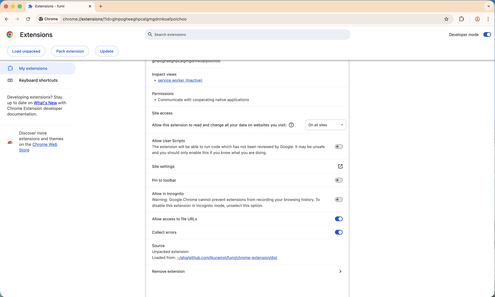

# Installation

fumi is macOS-only and targets Google Chrome. It is distributed as two Go binaries (`fumi`, `fumi-host`) plus an unpacked Chrome extension. A Homebrew tap and Chrome Web Store listing are planned but not yet available, so the only supported install path today is building from source.

## Requirements

- macOS (Darwin). The CLI refuses to run on other platforms.
- Google Chrome with **Developer mode** enabled. fumi uses `chrome.userScripts`, which Chrome gates behind this flag.
- Go 1.26+ and Node.js 22+ (with pnpm) for building.

## Build

```bash
git clone https://github.com/tkuramot/fumi.git
cd fumi

go build -o ./bin/fumi      ./cmd/fumi
go build -o ./bin/fumi-host ./cmd/fumi-host

cd chrome-extension && pnpm install && pnpm build && cd ..
```

Place `fumi` and `fumi-host` somewhere on your `PATH`. The path to `fumi-host` is baked into the Native Messaging manifest at `fumi setup` time, so if you move the binary later, re-run `fumi setup --force`.

### Build-time variables

The extension ID is baked in from `cmd/fumi/constants.go` (`extensionID`, committed) and derived from the `"key"` field in `chrome-extension/public/manifest.json`. Both are written by `./scripts/gen-release-key.sh` once per project and committed — so dev, unpacked, and Chrome Web Store installs all share the same ID. No per-build override is needed.

Only one value is overridden at release time via `-ldflags`:

| Variable | Default | Purpose |
|---|---|---|
| `main.hostBinaryPath` | `/opt/homebrew/bin/fumi-host` | Path written into the Native Messaging manifest |

## Install

### 1. Initialize the store and manifest

```bash
fumi setup
```

This does, in order:

1. Creates the store at `~/.config/fumi/` (or `$FUMI_STORE` if set). Subdirectories `actions/` and `scripts/` are created with mode `0700`.
2. Writes a template `config.toml` at `~/.config/fumi/config.toml` (mode `0600`).
3. Writes the Native Messaging manifest to `~/Library/Application Support/Google/Chrome/NativeMessagingHosts/com.tkrmt.fumi.json`.

Useful flags:

- `--force` — overwrite an existing manifest (safe; does not touch the store).

`fumi setup` does **not** create sample actions or scripts.

### 2. Load the Chrome extension (unpacked)

1. Open `chrome://extensions` and enable **Developer mode**.
2. Click **Load unpacked** and select `chrome-extension/dist`.
3. Copy the **Extension ID** shown on the card.
4. Open the extension's **Details** page and toggle **Allow User Scripts** on. fumi uses `chrome.userScripts`, which Chrome keeps disabled by default even with Developer mode enabled; without this toggle the service worker crashes on startup (see [troubleshooting.md](./troubleshooting.md#configureworld-error-in-the-service-worker)).

   

### 3. Verify the extension ID matches

The Native Messaging manifest's `allowed_origins` must contain your loaded extension's exact ID, or Chrome will refuse to connect to the host. Because the `"key"` committed in `chrome-extension/public/manifest.json` deterministically derives the ID, the value Chrome shows on `chrome://extensions` should match the one baked into `fumi` — run `fumi doctor` and confirm no `allowed_origins` mismatch is reported.

If you are forking and want your own ID, run `./scripts/gen-release-key.sh` once and commit the patched files; see Chrome's [extension key documentation](https://developer.chrome.com/docs/extensions/reference/manifest/key) for background.

### 4. Verify

```bash
fumi doctor
```

All rows should be `[OK]`. See [troubleshooting.md](./troubleshooting.md) if any are `[NG]`.

## Updating

```bash
git pull
go build -o ./bin/fumi ./cmd/fumi
go build -o ./bin/fumi-host ./cmd/fumi-host
(cd chrome-extension && pnpm build)
fumi setup --force          # only needed if hostBinaryPath changed
```

Then click **Reload** on the extension card in `chrome://extensions`.

## Uninstall

```bash
fumi uninstall
```

This removes the Native Messaging manifest only. Your store (`~/.config/fumi/`) is left untouched so your actions and scripts survive. Delete it manually if you want a clean slate:

```bash
rm -rf ~/.config/fumi
```

Then remove the extension from `chrome://extensions`.

## Known limitations

- Only the default Chrome install is detected. Chrome Canary, Chromium, Chrome Beta, and Chrome Dev each use their own NativeMessagingHosts directory and are not currently supported.
- One extension ID is pinned per build (via the committed manifest `"key"`). Loading the extension into multiple Chrome profiles is fine — they all derive the same ID — but loading a differently-keyed build alongside it will not work.
- Firefox, Edge, Safari, Linux, and Windows are not supported.
