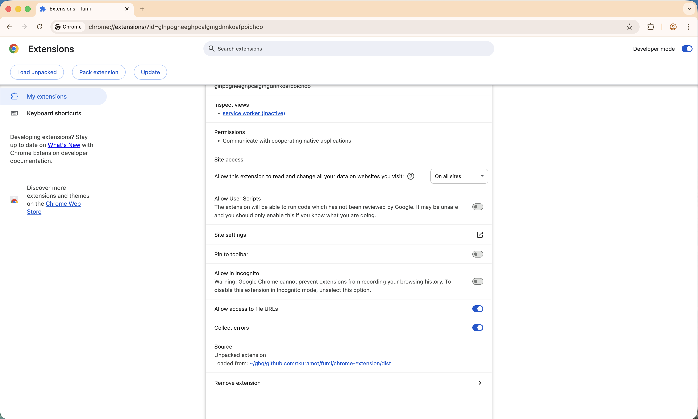

# Installation

fumi is macOS-only and targets Google Chrome. It is distributed as two Go binaries (`fumi`, `fumi-host`) installed via Homebrew, plus a Chrome extension installed from the Chrome Web Store.

## Requirements

- macOS (Darwin). The CLI refuses to run on other platforms.
- Google Chrome. fumi uses `chrome.userScripts`, which is gated behind the **Allow User Scripts** toggle on the extension's details page (see step 2 below).
- Go 1.26+ and Node.js 22+ (with pnpm) — **only if building from source**.

## Get the binaries

### Option A: Homebrew (recommended)

```bash
brew install --cask tkuramot/tap/fumi
```

Installs `fumi` and `fumi-host` to `/opt/homebrew/bin`, which is the default `hostBinaryPath` baked into the Native Messaging manifest.

### Option B: GitHub Releases

Download the `fumi_<version>_darwin_<arch>.tar.gz` archive for your Mac from the latest [GitHub release](https://github.com/tkuramot/fumi/releases), extract, and place `fumi` and `fumi-host` on your `PATH`. If you install `fumi-host` somewhere other than `/opt/homebrew/bin`, re-run `fumi setup --force` after moving it so the manifest points at the new location.

### Option C: Build from source

```bash
git clone https://github.com/tkuramot/fumi.git
cd fumi

go build -o ./bin/fumi      ./cmd/fumi
go build -o ./bin/fumi-host ./cmd/fumi-host

cd chrome-extension && pnpm install && pnpm build && cd ..
```

Place `fumi` and `fumi-host` somewhere on your `PATH`. The path to `fumi-host` is baked into the Native Messaging manifest at `fumi setup` time, so if you move the binary later, re-run `fumi setup --force`.

### Build-time variables

The extension ID is baked into `cmd/fumi/constants.go` (`extensionID`, committed) — the Chrome Web Store-assigned ID. Unpacked dev builds resolve to the same ID via `scripts/inject-dev-key.mjs` (run automatically by `scripts/build-dev.sh`), which patches a fixed public `key` into `dist/manifest.json`. There is no need to update the constant for local development.

Only one value is overridden at release time via `-ldflags`:

| Variable | Default | Purpose |
|---|---|---|
| `main.hostBinaryPath` | `/opt/homebrew/bin/fumi-host` | Path written into the Native Messaging manifest |

## Install

### 1. Initialize the store and manifest

```bash
fumi setup
```

This does, in order:

1. Creates the store at `~/.config/fumi/` (or `$FUMI_STORE` if set). Subdirectories `actions/` and `scripts/` are created with mode `0700`.
2. Writes a template `config.toml` at `~/.config/fumi/config.toml` (mode `0600`).
3. Writes the Native Messaging manifest to `~/Library/Application Support/Google/Chrome/NativeMessagingHosts/com.tkrmt.fumi.json`.

Useful flags:

- `--force` — overwrite an existing manifest (safe; does not touch the store).

`fumi setup` does **not** create sample actions or scripts.

### 2. Install the Chrome extension

#### Option A: Chrome Web Store (recommended)

Install fumi from the [Chrome Web Store listing](https://chromewebstore.google.com/detail/fumi/dcefklfhoacdcnhpmbfefdljlfeefebp). After installation, open the extension's **Details** page and toggle **Allow User Scripts** on. fumi uses `chrome.userScripts`, which Chrome keeps disabled by default; without this toggle the service worker crashes on startup (see [troubleshooting.md](./troubleshooting.md#configureworld-error-in-the-service-worker)).



#### Option B: Unpacked (development)

For working on fumi itself, run `scripts/build-dev.sh` then load `chrome-extension/dist/` as an unpacked extension at `chrome://extensions` with **Developer mode** enabled. The dev-key injection ensures the unpacked install resolves to the same ID as the Chrome Web Store build, so `allowed_origins` matches without rebuilding `fumi`. Toggle **Allow User Scripts** on as above.

### 3. Verify

```bash
fumi doctor
```

All rows should be `[OK]`. See [troubleshooting.md](./troubleshooting.md) if any are `[NG]`.

## Updating

### Homebrew + Chrome Web Store

```bash
brew upgrade --cask tkuramot/tap/fumi
```

Chrome auto-updates the extension from the Web Store within a few hours; to update immediately, click **Update** on `chrome://extensions` with **Developer mode** enabled. Keep the binary and extension versions reasonably in sync — the Native Messaging protocol isn't versioned, so mixing a much newer extension with an older host (or vice versa) is not supported.

### From source

```bash
git pull
go build -o ./bin/fumi ./cmd/fumi
go build -o ./bin/fumi-host ./cmd/fumi-host
(cd chrome-extension && pnpm build)
fumi setup --force          # only needed if hostBinaryPath changed
```

Then click **Reload** on the extension card in `chrome://extensions`.

## Uninstall

```bash
fumi uninstall
```

This removes the Native Messaging manifest only. Your store (`~/.config/fumi/`) is left untouched so your actions and scripts survive. Delete it manually if you want a clean slate:

```bash
rm -rf ~/.config/fumi
```

Then remove the extension from `chrome://extensions`.

## Known limitations

- Only the default Chrome install is detected. Chrome Canary, Chromium, Chrome Beta, and Chrome Dev each use their own NativeMessagingHosts directory and are not currently supported.
- One extension ID is pinned per build (via `extensionID` in `cmd/fumi/constants.go`). Loading a build with a different ID alongside it will not work — only one origin is in `allowed_origins`. The dev-key injection in `scripts/build-dev.sh` keeps unpacked builds on the same ID as the Chrome Web Store build.
- Firefox, Edge, Safari, Linux, and Windows are not supported.
