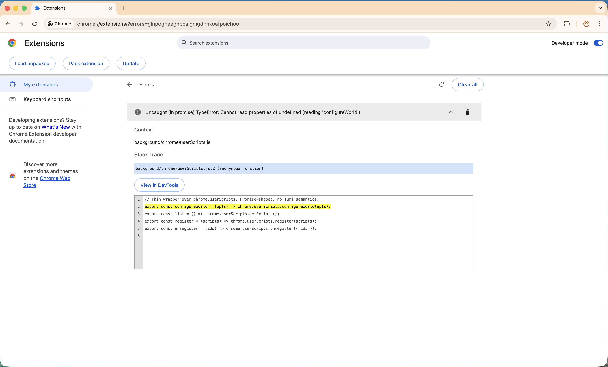

# Troubleshooting

Start every investigation with `fumi doctor`. It runs the same checks the extension relies on and prints a table of `[OK] / [WARN] / [NG]` rows.

## Extension cannot reach the host

Symptom: `fumi.run` rejects immediately, or the extension console logs:

> Specified native messaging host not found.

or

> Access to the specified native messaging host is forbidden.

Causes, in order of frequency:

1. **Extension ID mismatch.** The unpacked extension's ID does not match the one pinned into the manifest's `allowed_origins`. Compare the ID on `chrome://extensions` with the one in `~/Library/Application Support/Google/Chrome/NativeMessagingHosts/com.tkrmt.fumi.json`. If different, rebuild `fumi` with `-ldflags "-X main.unpackedExtensionID=<id>"` and re-run `fumi setup --force`. See [installation.md](./installation.md#3-pin-the-extension-id).
2. **Manifest missing.** You installed the extension but never ran `fumi setup`. Run it.
3. **Wrong Chrome channel.** You loaded the extension into Chrome Canary or Chromium, which look in different `NativeMessagingHosts` directories. Only stable Google Chrome is supported today.
4. **`fumi-host` is not where the manifest says.** Check the `path` field in the manifest and make sure the binary exists and is executable. If you moved the binary, re-run `fumi setup --force` after rebuilding with an updated `main.hostBinaryPath`.
5. **macOS quarantine.** A binary downloaded from the web may be marked with `com.apple.quarantine`, preventing exec. For a build you compiled yourself this should not happen, but if `fumi doctor` says the host is not executable, check with `xattr ~/path/to/fumi-host` and clear with `xattr -d com.apple.quarantine ~/path/to/fumi-host`.

## `fumi.run` rejects with a specific error code

See the full table in [security.md](./security.md#error-codes). The common ones:

| Error | Likely cause | Fix |
|---|---|---|
| `SCRIPT_NOT_FOUND` | Typo in the first argument, or the file is under a subdirectory you didn't include in the path. | `fumi scripts list` to see the exact path. |
| `SCRIPT_NOT_EXECUTABLE` | Forgot `chmod +x`. | `chmod +x ~/.config/fumi/scripts/<name>`. |
| `SCRIPT_NOT_REGULAR_FILE` | The file is a symlink or a directory. | Replace with a regular file; symlinks are rejected by design. |
| `SCRIPT_INVALID_PATH` | The path contains `..`, is absolute, or resolves outside `scripts/`. | Use a relative path under `scripts/`. |
| `EXEC_TIMEOUT` | Script ran longer than the timeout (30 s default). | Shorten the script, raise the timeout in `fumi.run(..., { timeoutMs })`, or spawn a detached background job from the script and return. |
| `EXEC_OUTPUT_TOO_LARGE` | Script wrote more than 768 KiB to stdout or 128 KiB to stderr. | Stream output to a file and return the path; reduce logging. |
| `EXEC_SPAWN_FAILED` | No shebang, wrong interpreter, or binary incompatibility (e.g., x86 binary on Apple Silicon without Rosetta). | Add a shebang; verify the interpreter is installed; check architecture. |

## `fumi doctor` reports `[WARN]` on store permissions

The store directory is not `0700`. Fix with:

```bash
chmod 700 ~/.config/fumi
chmod 700 ~/.config/fumi/actions ~/.config/fumi/scripts
```

## `configureWorld` error in the service worker

Symptom: the extension's service worker logs

> Uncaught (in promise) TypeError: Cannot read properties of undefined (reading 'configureWorld')



Cause: **Allow User Scripts** is off on the extension's details page, so `chrome.userScripts` is `undefined`. Toggle it on (see [installation.md](./installation.md#2-load-the-chrome-extension-unpacked)) and reload the extension.

## An action never injects

1. Open the fumi popup and click **Reload actions**. The extension does not watch the filesystem.
2. Open the service worker console from `chrome://extensions` → **Inspect views: service worker**. Frontmatter errors and registration failures are logged there.
3. Verify the action shows up in `fumi actions list`. If not, frontmatter is invalid — see the CLI's error output.
4. Verify the match pattern matches your URL. Chrome match patterns are stricter than glob patterns.

## Frontmatter is rejected

The parser is strict. Common causes:

- Directive name is not lowercase (use `@match`, not `@Match`).
- Unknown directive (e.g. `@run-at`, `@name`) — these are intentionally rejected, not ignored.
- Two actions derive the same ID (either both use `@id foo` or two filenames normalize to the same string). Rename one or set `@id` explicitly.
- The end delimiter `// ==/Fumi Action==` is missing. The parser refuses to guess where the block ends.

## Output arrives empty or garbled

- `fumi.run` does not stream. All output appears at once when the script exits; a hanging script produces nothing until it times out.
- Stdout and stderr are decoded as UTF-8. Non-UTF-8 bytes become the replacement character `�`. If your script emits binary, base64-encode it first.
- Excess output past the size caps is silently dropped *and* the call rejects with `EXEC_OUTPUT_TOO_LARGE`. You may see partial output in `stdout` on the rejection.

## `fumi doctor` says `allowed_origins` mismatch

The manifest was generated against a different extension ID than the one currently loaded. Either:

- Rebuild `fumi` with the current ID and `fumi setup --force`, or
- Stabilize the extension ID by setting `"key"` in `chrome-extension/public/manifest.json` before building — then the ID is the same across reloads and profiles.

## Nothing works after upgrading

1. `fumi setup --force` — rewrites the manifest in case `hostBinaryPath` changed.
2. Reload the extension from `chrome://extensions`.
3. Restart Chrome — Native Messaging manifests are sometimes cached per session.

## Still stuck

Collect:

- `fumi doctor` output.
- The extension's service worker logs (`chrome://extensions` → Inspect views).
- The error message from `fumi.run` (full `.message`).
- Your `fumi --version` (once released) or commit hash.

Then open an issue at <https://github.com/tkuramot/fumi/issues>.
